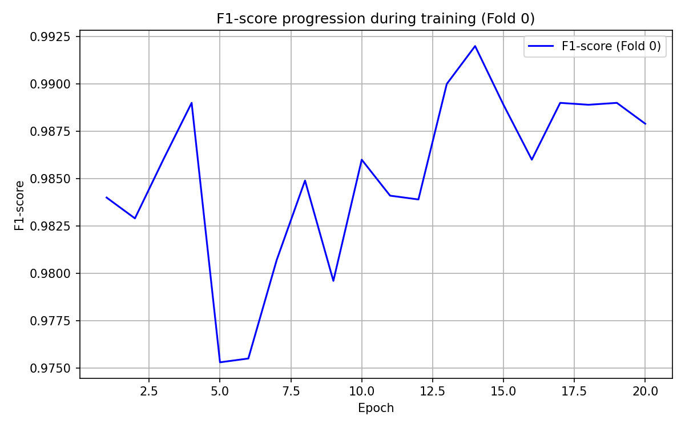
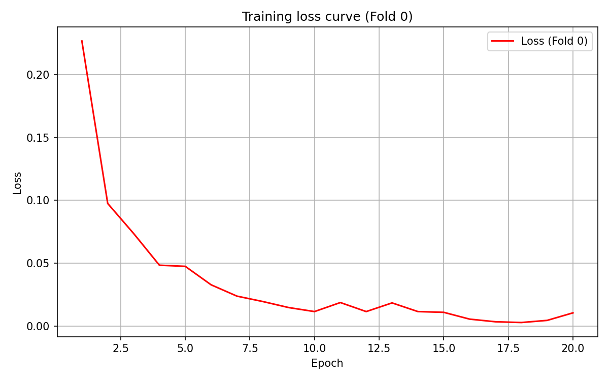

# Quantum Machine Learning: Binary Image Classification

[](LICENSE)

This project systematically explores the **challenges and opportunities of Quantum Machine Learning (QML)** for binary classification tasks on standard image datasets, inspired by the review _Challenges and Opportunities in Quantum Machine Learning_ (Cerezo et al., 2023).

## 🧑‍🔬 Intent

- Evaluate classical and quantum models on binary classification of classes **3 vs 8** across three image datasets: Fashion-MNIST, SVHN, and CIFAR-10.
- Analyze trainability, generalization, and performance gaps between classical MLPs, Quantum MLPs, and later CNNs.
- Identify optimization difficulties like barren plateaus in QML and explore how inductive biases (e.g., convolutions) could improve future quantum models.

## 📂 Datasets

- **Fashion-MNIST**: 28×28 grayscale images of clothes (Dress vs Bag).
- **SVHN**: 32×32 RGB images of street numbers (Digits 3 vs 8).
- **CIFAR-10**: 32×32 RGB images of objects (Cat vs Ship).

Datasets are automatically downloaded using `torchvision.datasets` during training.

## 📊 Results Summary

**Classical MLP**  
- Fashion-MNIST: Mean F1 ≈ 0.987, ROC-AUC ≈ 0.998  
- SVHN: Mean F1 ≈ 0.800, ROC-AUC ≈ 0.924  
- CIFAR-10: Mean F1 ≈ 0.798, ROC-AUC ≈ 0.887

**Quantum MLP**  
- Fashion-MNIST: Mean F1 ≈ 0.639 (instability in one fold)
- SVHN: Mean F1 ≈ 0.852, Recall ≈ 0.99, Precision ≈ 0.75
- CIFAR-10: Mean F1 ≈ 0.67–0.70, high variability across runs

Results confirm **classical models' stability**, while **quantum models show promise but suffer optimization instabilities**, especially on complex datasets.

## 🚀 How to Run

Clone this repository:

```bash
git clone https://github.com/yourusername/qml-binary-classification.git
cd qml-binary-classification

Set up your environment (recommend using conda)
conda env create -f environment.yml
conda activate qml_project

Train a model (e.g., classical MLP on Fashion-MNIST):
python train_classical.py --config configs/config_train_classical_fashion.yaml

Train Quantum MLP on CIFAR-10:
python train_quantum_mlp.py --config configs/config_train_quantum_mlp_cifar10.yaml

Evaluate trained models:
python evaluate.py --checkpoint checkpoints/model_fold_0.pth --config configs/config_train_classical_fashion.yaml

📑 Configuration System
Training is entirely configuration-driven with YAML files in configs/, allowing you to modify:

Dataset parameters: input size, classes, normalization

Model parameters: architecture, depth, learning rate, batch size

Training settings: epochs, early stopping, k-fold cross-validation

📈 Visualizations
Training dynamics (loss, F1), confusion matrices, and quantum kernel matrices are saved automatically in outputs/.

## 📸 Example Outputs

Here’s a sample of training dynamics for the classical MLP on Fashion-MNIST:

<p float="left">
  
  
</p>

These plots help diagnose convergence behavior and training stability across folds.


📝 Citing
If you use or build on this project, please cite:

Fouepe Dylan Berkamp, "Investigating Quantum Machine Learning Challenges through Binary Classification of Standard Image Datasets," 2025.

📜 License
This project is licensed under the MIT License — see LICENSE for details.

🙋 Questions?
Feel free to open an issue or contact me at dylan.fouepe@edu.unifi.it.


